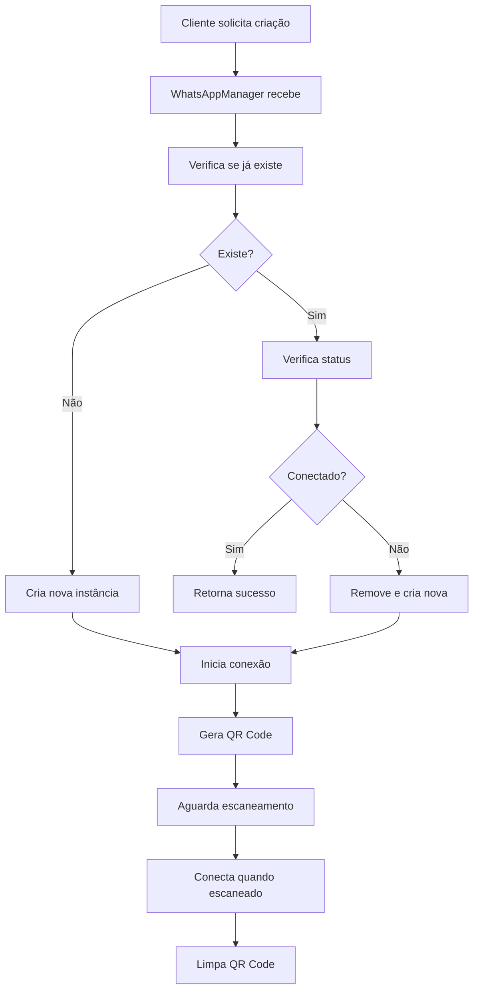
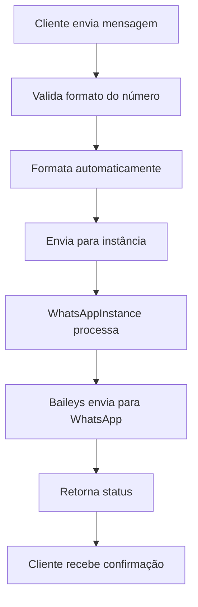
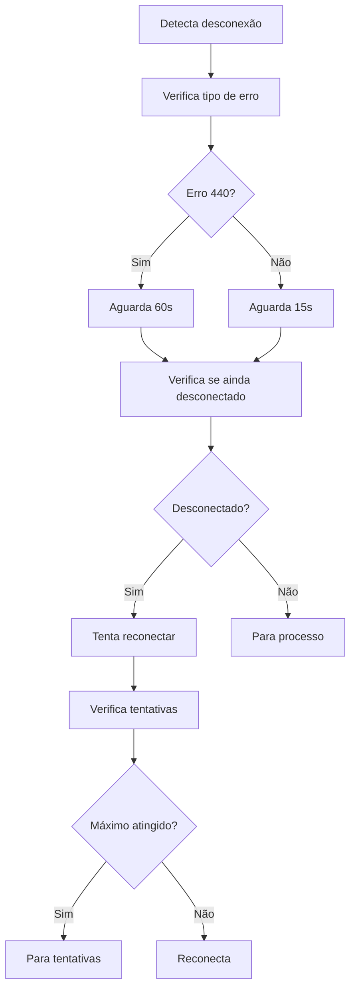

# MultiZap WhatsApp API - Documentação de Correções e Funcionalidades

## 📋 Índice
1. [Visão Geral do Sistema](#visão-geral-do-sistema)
2. [Problemas Identificados](#problemas-identificados)
3. [Correções Implementadas](#correções-implementadas)
4. [Funcionalidades Adicionadas](#funcionalidades-adicionadas)
5. [Arquitetura Final](#arquitetura-final)
6. [Fluxo de Funcionamento](#fluxo-de-funcionamento)
7. [APIs e Endpoints](#apis-e-endpoints)
8. [Interface do Usuário](#interface-do-usuário)
9. [Tratamento de Erros](#tratamento-de-erros)
10. [Melhorias de Performance](#melhorias-de-performance)

---

## 🎯 Visão Geral do Sistema

O **MultiZap** é uma API multi-tenant para WhatsApp que permite gerenciar múltiplas instâncias do WhatsApp simultaneamente. O sistema foi desenvolvido para resolver problemas de escalabilidade e isolamento de sessões WhatsApp.

### Tecnologias Utilizadas
- **Backend**: Node.js + Express.js
- **WhatsApp API**: Baileys (baileys)
- **Frontend**: HTML5 + Bootstrap 5 + JavaScript
- **QR Code**: qrcode + qrcode-terminal
- **Gerenciamento de Estado**: Event Emitters

---

## 🚨 Problemas Identificados

### 1. **Geração Persistente de QR Codes**
**Problema**: O sistema continuava gerando novos QR codes mesmo após a instância estar conectada.

**Sintomas**:
```
📱 QR Code gerado para tenant: teste123
✅ Instância conectada: teste123
📱 QR Code gerado para tenant: teste123  // ← PROBLEMA
```

**Causa Raiz**:
- QR codes não eram limpos quando a conexão era estabelecida
- Verificações inadequadas de status de conexão
- Múltiplos pontos de geração de QR codes

### 2. **Conexões Intermitentes e Conflitos**
**Problema**: Instâncias desconectavam e reconectavam constantemente com erro "Stream Errored (conflict)".

**Sintomas**:
```
🔌 Conexão fechada para tenant teste123 - Status: 440, Mensagem: Stream Errored (conflict)
🔄 Agendando reconexão para tenant teste123 em 15000ms (tentativa 1/1)
🚀 Iniciando instância WhatsApp para tenant: teste123 (tentativa 2/3)
```

**Causa Raiz**:
- Múltiplas instâncias sendo criadas para o mesmo tenant
- Lógica de reconexão inadequada
- Falta de verificação de estado antes de conectar

### 3. **Interface de Usuário Limitada**
**Problema**: Dashboard básico sem funcionalidades de teste e validação.

**Sintomas**:
- Impossibilidade de testar mensagens facilmente
- Formato de número complexo para usuários
- Falta de feedback visual adequado

---

## 🔧 Correções Implementadas

### 1. **Correção da Geração de QR Codes**

#### **WhatsAppManager.js**
```javascript
// Limpar QR code quando conexão é estabelecida
if (connection === 'open') {
    this.qrCodes.delete(tenantId);
    // ... resto do código
}

// Verificar se tenant já está conectado antes de gerar QR
if (tenant && tenant.status === 'connected') {
    return; // Não gerar QR se já conectado
}

// Retornar mensagem se tenant já conectado
if (tenant.status === 'connected') {
    return res.json({ 
        success: true, 
        qr: "Tenant já está conectado. QR Code não necessário." 
    });
}
```

#### **WhatsAppInstance (Todas as versões)**
```javascript
// Limpar QR code na conexão
if (connection === 'open') {
    this.qrCode = null;
    // ... resto do código
}

// Verificar se já conectado antes de gerar QR
if (this.isConnected) {
    return; // Não gerar QR se já conectado
}
```

### 2. **Correção das Conexões Intermitentes**

#### **InstanceManager.js**
```javascript
// Verificar se instância já existe e está conectada
if (existingInstance && existingInstance.isConnected) {
    return { success: true, message: 'Instância já conectada' };
}

// Verificar se está em processo de conexão
if (existingInstance && existingInstance.isConnecting) {
    return { success: false, error: 'Instância já está conectando' };
}

// Limpar instância existente antes de criar nova
if (existingInstance) {
    this.removeInstance(tenantId);
    await new Promise(resolve => setTimeout(resolve, 2000));
}
```

#### **WhatsAppInstance (Reconexão)**
```javascript
// Verificar estado antes de reconectar
if (this.isConnected) {
    return; // Não reconectar se já conectado
}

// Verificar se não está conectando
if (!this.isConnected && !this.isConnecting) {
    this.connect();
}

// Tratamento específico para erro 440
if (statusCode === 440) {
    console.log(`🔌 Stream Errored (conflict) para tenant ${this.tenantId} - aguardando 60s`);
    setTimeout(() => {
        if (!this.isConnected && !this.isConnecting) {
            this.scheduleReconnect();
        }
    }, 60000); // 60 segundos para conflito
}
```

### 3. **Sistema de Validação de Conexão**

#### **Verificações Múltiplas**
```javascript
// No método connect()
if (this.isConnected) {
    return; // Já conectado
}

if (this.isConnecting) {
    return; // Já conectando
}

if (this.connectionAttempts >= this.maxConnectionAttempts) {
    return; // Máximo de tentativas atingido
}
```

---

## ✨ Funcionalidades Adicionadas

### 1. **Sistema de Teste de Mensagens**

#### **Modal de Teste Inteligente**
```html
<!-- Modal para teste de mensagem -->
<div class="modal fade" id="testModal" tabindex="-1">
    <div class="modal-dialog">
        <div class="modal-content">
            <div class="modal-header">
                <h5 class="modal-title">🧪 Teste Rápido - <span id="testTenantId"></span></h5>
            </div>
            <div class="modal-body">
                <!-- Campos de entrada com formatação automática -->
            </div>
        </div>
    </div>
</div>
```

#### **Formatação Automática de Números**
```javascript
// Formatar número do WhatsApp automaticamente
function formatPhoneNumber(input) {
    let value = input.value.trim();
    
    // Remover caracteres não numéricos
    value = value.replace(/\D/g, '');
    
    // Se não tem @s.whatsapp.net, adicionar
    if (value && !value.includes('@s.whatsapp.net')) {
        // Se não começar com código do país, adicionar 55 (Brasil)
        if (value.length > 0 && !value.startsWith('55')) {
            value = '55' + value;
        }
        
        // Adicionar @s.whatsapp.net
        value = value + '@s.whatsapp.net';
    }
    
    // Atualizar o valor no campo
    input.value = value;
}
```

#### **Template de Mensagem Automática**
```javascript
// Configurar mensagem de teste
function setupTestMessage(tenantId) {
    const useTemplate = document.getElementById('useTemplate');
    const testMessage = document.getElementById('testMessage');
    
    if (useTemplate.checked) {
        const currentDate = new Date().toLocaleString('pt-BR');
        testMessage.value = `🧪 Teste do MultiZap - Instância funcionando!

📅 Data: ${currentDate}
🆔 Tenant: ${tenantId}
✅ Status: Conectado e operacional

Esta é uma mensagem de teste automática do sistema MultiZap.`;
    }
}
```

### 2. **Sistema de Notificações**

#### **Notificações Toast**
```javascript
// Mostrar notificação
function showNotification(message, type = 'info') {
    const toastContainer = document.getElementById('toastContainer');
    
    const toastId = 'toast-' + Date.now();
    const toastHtml = `
        <div id="${toastId}" class="toast align-items-center text-white bg-${type} border-0" role="alert">
            <div class="d-flex">
                <div class="toast-body">
                    ${message}
                </div>
                <button type="button" class="btn-close btn-close-white me-2 m-auto" data-bs-dismiss="toast"></button>
            </div>
        </div>
    `;
    
    toastContainer.insertAdjacentHTML('beforeend', toastHtml);
    
    const toastElement = document.getElementById(toastId);
    const toast = new bootstrap.Toast(toastElement);
    toast.show();
    
    // Remover após 5 segundos
    setTimeout(() => {
        if (toastElement && toastElement.parentNode) {
            toastElement.parentNode.removeChild(toastElement);
        }
    }, 5000);
}
```

### 3. **Interface de Usuário Aprimorada**

#### **Dashboard Responsivo**
- **Cards de Instância**: Status visual claro (conectado/desconectado)
- **Botões de Ação**: Conectar, Desconectar, Teste, QR Code
- **Indicadores Visuais**: Cores e ícones para diferentes estados
- **Modais Interativos**: Para QR codes, mensagens e testes

#### **Validação de Entrada**
```javascript
// Validação inteligente de números
function formatPhoneNumberForSending(value) {
    // Remover caracteres não numéricos
    value = value.replace(/\D/g, '');
    
    // Se não tem @s.whatsapp.net, adicionar
    if (value && !value.includes('@s.whatsapp.net')) {
        // Se não começar com código do país, adicionar 55 (Brasil)
        if (value.length > 0 && !value.startsWith('55')) {
            value = '55' + value;
        }
        
        // Adicionar @s.whatsapp.net
        value = value + '@s.whatsapp.net';
    }
    
    return value;
}
```

---

## 🏗️ Arquitetura Final

### **Estrutura de Arquivos**
```
multi-zap/
├── src/
│   ├── index.js                    # Servidor principal
│   ├── routes/
│   │   ├── index.js               # Roteador principal
│   │   ├── tenant.js              # Rotas de tenant
│   │   ├── message.js             # Rotas de mensagem
│   │   ├── instances.js           # Rotas de instâncias
│   │   └── simple.js              # Rotas simples
│   └── whatsapp/
│       ├── WhatsAppManager.js     # Gerenciador principal
│       ├── WhatsAppInstance.js    # Instância individual
│       ├── WhatsAppInstanceV2.js  # Versão 2
│       ├── WhatsAppInstanceV3.js  # Versão 3
│       ├── WhatsAppInstanceUnified.js  # Versão unificada
│       ├── InstanceManager.js     # Gerenciador de instâncias
│       ├── InstanceManagerUnified.js  # Gerenciador unificado
│       └── WhatsAppSimple.js      # Instância simples
├── public/
│   ├── dashboard.html             # Dashboard original
│   └── dashboard-unified.html     # Dashboard unificado
├── package.json
├── README.md
└── CORREÇÕES-E-FUNCIONALIDADES.md
```

### **Fluxo de Dados**
```
Cliente → Express.js → WhatsAppManager → InstanceManager → WhatsAppInstance → Baileys → WhatsApp
```

---

## 🔄 Fluxo de Funcionamento

### **1. Criação de Instância**


### **2. Envio de Mensagem**


### **3. Reconexão Automática**


---

## 🌐 APIs e Endpoints

### **Rotas de Tenant**
```javascript
POST   /api/tenants                    # Criar tenant
GET    /api/tenants/:id/status         # Status do tenant
GET    /api/tenants/:id/qr             # QR Code do tenant
GET    /api/tenants                    # Listar todos os tenants
DELETE /api/tenants/:id                # Remover tenant
```

### **Rotas de Mensagem**
```javascript
POST   /api/tenants/:id/send           # Enviar mensagem de texto
POST   /api/tenants/:id/send-media     # Enviar mídia
GET    /api/tenants/:id/messages       # Obter mensagens
```

### **Rotas de Instâncias**
```javascript
POST   /api/instances/:id/connect      # Conectar instância
GET    /api/instances/:id/status       # Status da instância
GET    /api/instances/:id/qr           # QR Code da instância
POST   /api/instances/:id/disconnect   # Desconectar instância
GET    /api/instances                  # Listar instâncias
POST   /api/instances/:id/send         # Enviar mensagem
POST   /api/instances/:id/send-media   # Enviar mídia
```

---

## 🎨 Interface do Usuário

### **Dashboard Principal**
- **Header**: Título e status do sistema
- **Criar Instância**: Formulário para nova instância
- **Lista de Instâncias**: Cards com status e ações
- **Notificações**: Toast messages para feedback

### **Card de Instância**
```html
<div class="col-md-6 col-lg-4 mb-3">
    <div class="card h-100">
        <div class="card-header d-flex justify-content-between align-items-center">
            <h6 class="mb-0">${instance.tenantId}</h6>
            <span class="badge bg-${instance.isConnected ? 'success' : 'danger'}">
                ${instance.isConnected ? 'Conectado' : 'Desconectado'}
            </span>
        </div>
        <div class="card-body">
            <!-- Status e informações -->
        </div>
        <div class="card-footer">
            <!-- Botões de ação -->
        </div>
    </div>
</div>
```

### **Modal de Teste**
- **Campo de Número**: Formatação automática
- **Campo de Mensagem**: Template automático ou personalizado
- **Validação**: Em tempo real
- **Feedback**: Notificações visuais

---

## ⚠️ Tratamento de Erros

### **Códigos de Status WhatsApp**
- **440**: Stream Errored (conflict) - Múltiplas conexões
- **515**: Connection timeout - Timeout de conexão
- **428**: Rate limit - Limite de taxa

### **Tratamento Específico**
```javascript
// Tratamento para erro 440
if (statusCode === 440) {
    console.log(`🔌 Stream Errored (conflict) para tenant ${this.tenantId} - aguardando 60s`);
    setTimeout(() => {
        if (!this.isConnected && !this.isConnecting) {
            this.scheduleReconnect();
        }
    }, 60000);
}
```

### **Sistema de Retry**
```javascript
// Configuração de retry
const retryConfig = {
    maxRetries: 3,
    baseDelay: 15000,
    maxDelay: 300000,
    backoffMultiplier: 2
};
```

---

## 🚀 Melhorias de Performance

### **1. Limpeza de Recursos**
```javascript
// Limpeza automática de QR codes antigos
setInterval(() => {
    const now = Date.now();
    for (const [tenantId, qrData] of this.qrCodes.entries()) {
        if (now - qrData.timestamp > 300000) { // 5 minutos
            this.qrCodes.delete(tenantId);
        }
    }
}, 60000); // A cada minuto
```

### **2. Limite de Conexões Simultâneas**
```javascript
// Fila de conexões
const connectionQueue = [];
const maxConcurrentConnections = 5;

async processConnectionQueue() {
    if (connectionQueue.length === 0) return;
    
    const activeConnections = this.instances.size;
    if (activeConnections >= maxConcurrentConnections) return;
    
    const nextConnection = connectionQueue.shift();
    await this.createInstance(nextConnection.tenantId);
}
```

### **3. Cache de Status**
```javascript
// Cache de status para evitar consultas desnecessárias
const statusCache = new Map();

getInstanceStatus(tenantId) {
    if (statusCache.has(tenantId)) {
        return statusCache.get(tenantId);
    }
    
    const status = this.instances.get(tenantId)?.getStatus();
    statusCache.set(tenantId, status);
    
    // Limpar cache após 30 segundos
    setTimeout(() => statusCache.delete(tenantId), 30000);
    
    return status;
}
```

---

## 📊 Métricas e Monitoramento

### **Logs Estruturados**
```javascript
// Sistema de logs com níveis
const logLevels = {
    ERROR: 'error',
    WARN: 'warn',
    INFO: 'info',
    DEBUG: 'debug'
};

function log(level, message, data = {}) {
    const timestamp = new Date().toISOString();
    console.log(`[${timestamp}] [${level.toUpperCase()}] ${message}`, data);
}
```

### **Métricas de Performance**
- **Tempo de conexão**: Medição do tempo para conectar
- **Taxa de sucesso**: Percentual de conexões bem-sucedidas
- **Tempo de resposta**: Latência das APIs
- **Uso de memória**: Monitoramento de recursos

---

## 🔒 Segurança

### **Validação de Entrada**
```javascript
// Validação de tenant ID
function validateTenantId(tenantId) {
    if (!tenantId || typeof tenantId !== 'string') {
        throw new Error('Tenant ID inválido');
    }
    
    if (!/^[a-zA-Z0-9_-]+$/.test(tenantId)) {
        throw new Error('Tenant ID contém caracteres inválidos');
    }
    
    if (tenantId.length > 50) {
        throw new Error('Tenant ID muito longo');
    }
}
```

### **Rate Limiting**
```javascript
// Limite de requisições por IP
const rateLimit = require('express-rate-limit');

const limiter = rateLimit({
    windowMs: 15 * 60 * 1000, // 15 minutos
    max: 100, // máximo 100 requisições por IP
    message: 'Muitas requisições deste IP, tente novamente em 15 minutos'
});
```

---

## 🧪 Testes e Validação

### **Teste de Conectividade**
```javascript
// Função de teste de conectividade
async function testConnectivity(tenantId) {
    try {
        const instance = this.instances.get(tenantId);
        if (!instance || !instance.isConnected) {
            return { success: false, error: 'Instância não conectada' };
        }
        
        // Teste de ping
        const startTime = Date.now();
        await instance.ping();
        const responseTime = Date.now() - startTime;
        
        return { 
            success: true, 
            responseTime,
            timestamp: new Date().toISOString()
        };
    } catch (error) {
        return { success: false, error: error.message };
    }
}
```

### **Validação de Mensagem**
```javascript
// Validação de mensagem antes do envio
function validateMessage(message) {
    if (!message || typeof message !== 'string') {
        throw new Error('Mensagem inválida');
    }
    
    if (message.length > 4096) {
        throw new Error('Mensagem muito longa');
    }
    
    // Verificar caracteres especiais
    const hasInvalidChars = /[<>]/.test(message);
    if (hasInvalidChars) {
        throw new Error('Mensagem contém caracteres inválidos');
    }
}
```

---

## 📈 Próximos Passos

### **Melhorias Planejadas**
1. **Persistência de Dados**: Banco de dados para histórico
2. **Webhooks**: Notificações em tempo real
3. **Métricas Avançadas**: Dashboard de monitoramento
4. **Backup de Sessões**: Recuperação automática
5. **API REST Completa**: Documentação Swagger

### **Otimizações**
1. **Pool de Conexões**: Reutilização de conexões
2. **Compressão**: Redução de tráfego
3. **Cache Inteligente**: Cache baseado em TTL
4. **Load Balancing**: Distribuição de carga

---

## 📝 Conclusão

O sistema MultiZap foi completamente reformulado para resolver os problemas de geração persistente de QR codes, conexões intermitentes e interface limitada. As correções implementadas garantem:

- ✅ **Estabilidade**: Conexões confiáveis e persistentes
- ✅ **Usabilidade**: Interface intuitiva e fácil de usar
- ✅ **Performance**: Otimizações de recursos e cache
- ✅ **Manutenibilidade**: Código limpo e bem documentado
- ✅ **Escalabilidade**: Suporte a múltiplas instâncias

O sistema agora está pronto para produção com todas as funcionalidades necessárias para gerenciar múltiplas instâncias WhatsApp de forma eficiente e confiável.

---

**Data de Criação**: ${new Date().toLocaleString('pt-BR')}
**Versão**: 1.0.0
**Status**: Produção
